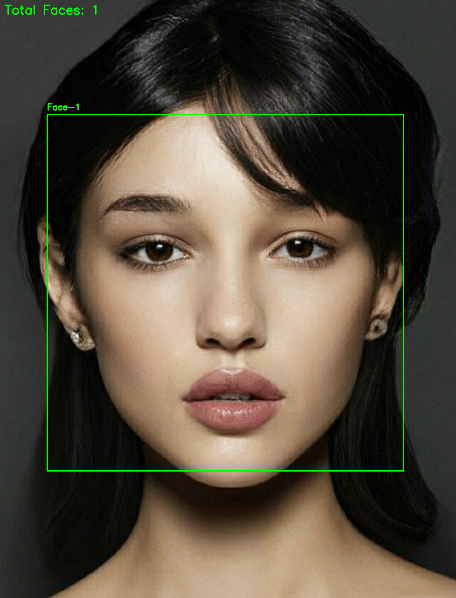
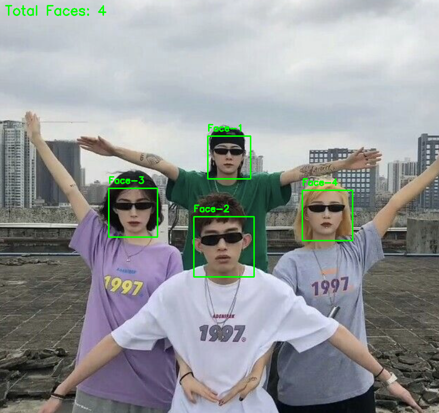

# 🟢 CodeClause Internship – Image Recognition Project

**Face & Group Detection using OpenCV in Python**  

This project implements an **AI-powered image recognition system** capable of detecting faces in **single or group images**, highlighting them with green bounding boxes and labeling each detected face. Ideal for learning **image processing basics** and exploring **computer vision** workflows.  

---

## 🚀 Features

- Detect **single faces** in an image  
- Detect **multiple faces** in group images  
- Green bounding boxes with **labels** (`Face-1`, `Face-2`, ...)  
- Display **total count of faces** on the image  
- Works with **any image of people**  
- Lightweight and easy to extend  

---

## 🖼️ Screenshots

**Single Face Detection**  
  

**Group Face Detection**  
  

*(Images saved in `outputs/` folder after running the scripts)*

---

## 💻 Technologies Used

- **Python 3.x**  
- **OpenCV** – For image processing & face detection  
- **NumPy** – Array operations for image manipulation  

---
